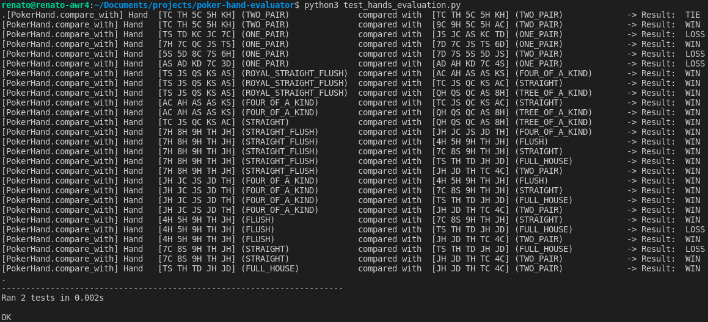
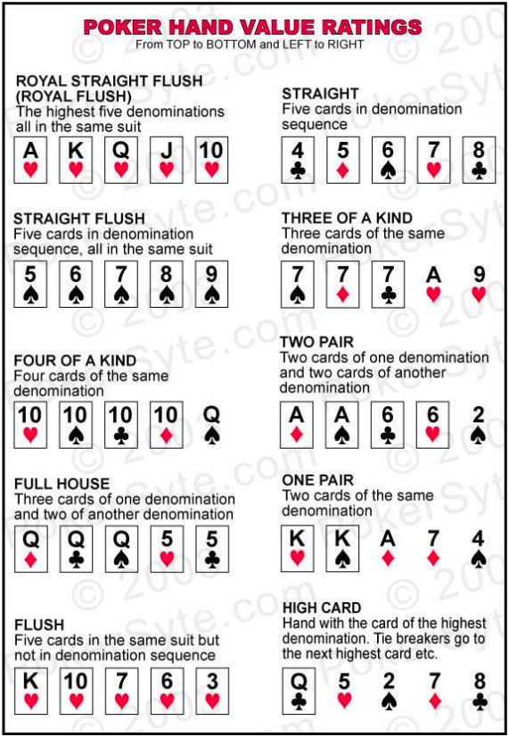

# poker-hand-evaluator

This project was developed to be presented as the

# Dependencies

This project was developed and run on Ubuntu 20.04 LTS. The following dependencies/modules were used:

- Python 3.8.10
- Python built-in modules:
    - collections
    - enum
    - unittest
    - argparse

# Installation

Clone this repository

```bash
git clone https://github.com/rodriguesrenato/poker-hand-evaluator.git
```

# Usage

The Python Challenge tests can be executed by running the following command in the terminal, on the `poker-hand-evaluator` folder:

```bash
python3 test_hands_evaluation.py
```

Here is the output of the unit tests (with `debug_level` set as 1):



The `PokerHand` class can be directly imported in your own solution. The `PokerRanking` class has the predefined poker hand classifications and `PokerResult` class is the comparison result between two hands

```python
from poker_hand import PokerHand, PokerRanking, PokerResult
```

# Solution

## Poker Rules



A print function was implemented to assist debugging the solution. The "_debug_level" PokerHand member attribute defines how much information will be shown in the output:

| _debug_level | Information |
|---|---|
| 0 | Debug off |
| 1 | PokerHand comparison result|
| greater or equal 2 | Initialized hand details and classification, and PokerHand comparison result |

# License 

The contents of this repository are covered under the MIT License.

# References

- Tie break rules: https://pokerdicas.com/regras/regras-de-desempate-no-texas-holdem/